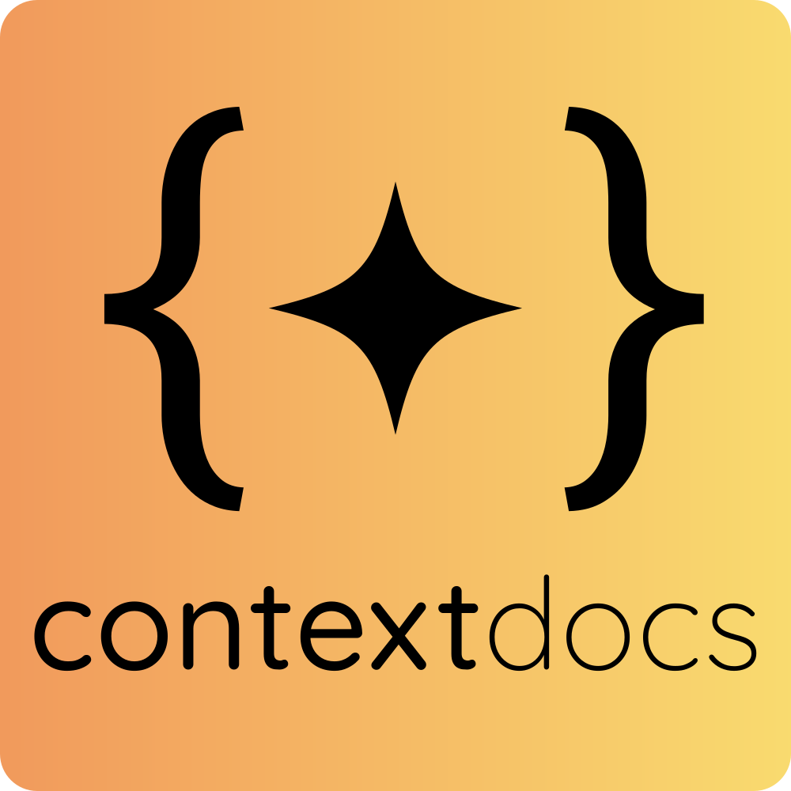

<p align="center">
  
</p>

<p align="center">
  <strong>Keep your AI coding assistants in sync with your codebase — generate, maintain, and audit context files for 7 AI tools.</strong>
</p>

<p align="center">
  <a href="CHANGELOG.md"></a>
  <a href="LICENSE"></a>
  <a href="https://code.claude.com/docs/en/plugins"></a>
  <a href="https://opencode.ai/"></a>
</p>

<p align="center">
  <a href="#-get-started">Get Started</a> · <a href="#-features">Features</a> · <a href="#-commands">Commands</a> · <a href="CONTRIBUTING.md">Contributing</a>
</p>

---

## ⚡ Get Started

Get your first AI context files generated in under 60 seconds.

### Prerequisites

- [Claude Code](https://code.claude.com/) or [OpenCode](https://opencode.ai/) installed

### Install

```bash
# 1. Add the LBA plugin marketplace (once)
/plugin marketplace add littlebearapps/lba-plugins

# 2. Install ContextDocs
/plugin install contextdocs@lba-plugins

# 3. Bootstrap AI context for your project
/contextdocs:ai-context init
```

**Optional — install Context Guard hooks (Claude Code only):**

```bash
# 4. Keep context files in sync as your project evolves
/contextdocs:context-guard install
```

---

## 🚀 What ContextDocs Does

AI coding assistants work better when they understand your project's conventions, but research shows that overstuffed context files **reduce** AI task success by ~3% and increase token costs by 20% (ETH Zurich, 2026).

ContextDocs generates lean context files for 7 AI tools from a single codebase scan, using the **Signal Gate principle** — only what agents cannot discover on their own. It handles the full lifecycle: bootstrap new projects with `init`, patch drift with `update`, promote Claude's auto-learned patterns to CLAUDE.md with `promote`, verify health with `context-verify`, and enforce freshness with Context Guard hooks.

Every context file stays within line budgets (CLAUDE.md <80, AGENTS.md <120, others <60) and excludes discoverable content like directory listings, file trees, and architecture overviews that agents find on their own.

---

## 🎯 Features

- 🧠 **Signal Gate filtering** — includes only what AI tools cannot discover by reading source code, keeping context files lean and effective
- 📋 **7 context file types** — AGENTS.md, CLAUDE.md, .cursorrules, copilot-instructions.md, .windsurfrules, .clinerules, GEMINI.md from a single codebase scan
- 🔄 **Full lifecycle management** — `init` bootstraps, `update` patches drift, `promote` moves MEMORY.md patterns to CLAUDE.md, `audit` checks staleness
- ✅ **Context health scoring** — 0–100 score across 5 dimensions (line budget, signal quality, path accuracy, consistency, freshness) with CI integration
- 🔒 **Context Guard** — two-tier enforcement: session-end nudge (Tier 1) and pre-commit blocking (Tier 2) keep context files in sync *(Claude Code only)*
- 🛡️ **Content filter protection** — handles Claude Code's API filter for CODE_OF_CONDUCT, LICENSE, and SECURITY *(Claude Code only)*
- 🔌 **Works with 7+ AI tools** — Claude Code, OpenCode, Codex CLI, Cursor, Windsurf, Cline, Gemini CLI

---

## 🤖 Commands

| Command | What It Does |
|---------|-------------|
| `/contextdocs:ai-context` | Generate lean AI context files using Signal Gate — `init` bootstraps, `update` patches drift, `promote` moves MEMORY.md patterns to CLAUDE.md |
| `/contextdocs:context-guard` | Install, uninstall, or check status of Context Guard hooks *(Claude Code only)* |
| `/contextdocs:context-verify` | Validate context file quality — line budgets, stale paths, consistency, health scoring |

### Quick Examples

```bash
/contextdocs:ai-context init          # Bootstrap context for a new project
/contextdocs:ai-context update        # Patch only what drifted
/contextdocs:ai-context promote       # Move MEMORY.md patterns to CLAUDE.md
/contextdocs:ai-context audit         # Check for staleness and drift
/contextdocs:context-verify           # Score context file health (0–100)
/contextdocs:context-guard install    # Install freshness hooks (Tier 1)
```

---

## 🔗 Related

For public-facing repository documentation (README, CHANGELOG, ROADMAP, user guides, launch artifacts), see [PitchDocs](https://github.com/littlebearapps/pitchdocs).

---

## 🤝 Contributing

See our [Contributing Guide](CONTRIBUTING.md) to get started.

---

## 📄 Licence

[MIT](LICENSE) — Made by [Little Bear Apps](https://littlebearapps.com) 🐶
